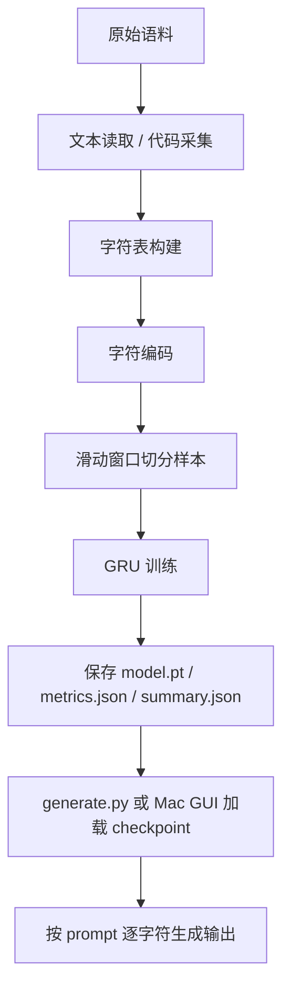

# SZ-AI 完整逻辑

这份文档说明当前仓库里 `SZ-AI` 的完整工作逻辑。

先说结论：现在这个项目不是 DeepSeek 那种大模型系统，而是一个可在本地和 GitHub Actions 上运行的轻量字符级语言模型工程。它已经具备完整闭环：

- 训练语料准备
- 代码语料自动采集
- 模型训练
- 模型保存
- 文本生成
- macOS 本地测试界面
- GitHub Actions 自动运行

## 1. 当前系统是什么

当前系统分成两条主线：

1. 通用文本模型 `SZ-AI-R1/V1`
2. 代码助手模型 `SZ-AI-Code-R1/V1`

两者共用同一套底层模型逻辑，区别主要在训练数据来源和默认配置不同。

当前底层模型不是 Transformer，而是字符级 GRU 语言模型。

也就是说：

- 输入单位是“字符”，不是 token tokenizer
- 模型按字符预测下一个字符
- 生成时是一字符一字符往后续写

这条路线的优点是简单、稳定、容易在免费 GitHub Actions 上跑通。缺点是模型能力上限不高，不适合追求大模型级别的推理能力。

## 2. 系统总流程



## 3. 仓库里的核心模块

### 3.1 数据处理

文件：`src/sz_ai/data.py`

职责：

- 读取训练文本
- 构建字符级词表
- 做字符到索引的编码
- 把整段文本切成训练窗口
- 生成训练集和验证集

核心逻辑：

1. `read_text`
   读取文本文件并去掉首尾空白。
   如果文件为空，直接报错。

2. `build_vocab`
   从训练文本里取出所有不重复字符，并排序后形成 `vocab`。

3. `encode_text`
   把每个字符映射成整数 id。
   如果遇到词表外字符，回退到空格字符，找不到空格时回退到 0。

4. `build_datasets`
   用滑动窗口从长文本中构造训练样本。
   例如配置 `seq_len=128` 时，会拿长度为 `129` 的窗口：
   前 128 个字符做输入，第 2 到第 129 个字符做目标。

5. 数据集拆分
   所有窗口位置会先打乱，再按 `val_ratio` 切成训练集和验证集。

### 3.2 模型定义

文件：`src/sz_ai/model.py`

职责：

- 定义字符级语言模型
- 保存和加载 checkpoint
- 处理采样逻辑
- 负责最终文本生成

模型结构：

1. `Embedding`
   把字符 id 映射到向量。

2. `GRU`
   对字符序列建模。

3. `Linear head`
   把 GRU 输出映射回整个字符表大小的 logits。

当前前向逻辑非常直接：

```text
input_ids
-> embedding
-> GRU
-> linear
-> 每个位置对应整个 vocab 的预测分布
```

### 3.3 训练入口

文件：`scripts/train.py`

职责：

- 读取配置
- 加载数据
- 建模
- 执行训练和验证
- 保存最佳 checkpoint
- 训练后自动生成样例文本

训练逻辑是：

1. 读取 JSON 配置
2. 根据配置找到训练语料
3. 构建字符表和训练样本
4. 初始化模型
5. 使用 `AdamW` 优化器
6. 使用 `cross_entropy` 做下一个字符预测损失
7. 每个 epoch 先训练，再验证
8. 用 `val_loss` 作为优先指标保存最佳模型
   如果没有验证集，就退化为看 `train_loss`
9. 写出以下产物：

- `model.pt`
- `metrics.json`
- `summary.json`
- `effective-config.json`
- `sample.txt`

### 3.4 推理入口

文件：`scripts/generate.py`

职责：

- 加载已经训练好的 `model.pt`
- 接收 prompt
- 生成续写文本

生成逻辑：

1. 读取 checkpoint
2. 从 checkpoint 中恢复：
   `model_state_dict`
   `config`
   `vocab`
3. 把 prompt 编码成字符 id
4. 每一步都把“当前已有全部字符”送进模型
5. 取最后一个位置的 logits 作为“下一个字符”概率
6. 用 `temperature` 和 `top-k` 做采样
7. 把采样出的字符拼回文本

这个实现没有做缓存优化，所以每生成一个字符都会重新跑一遍当前全序列。优点是实现简单；缺点是生成越长越慢。

## 4. 通用文本模型逻辑

文件：

- `configs/sz-ai-r1-v1.json`
- `data/train.txt`
- `.github/workflows/train-sz-ai-r1-v1.yml`

这条线的目标是训练一个轻量中文文本生成模型。

默认流程：

1. 读取 `data/train.txt`
2. 构建字符级训练集
3. 训练 `SZ-AI-R1/V1`
4. 输出训练产物到 `artifacts/SZ-AI-R1-V1`
5. 用默认 prompt `SZ-AI: ` 自动生成样例

适合做：

- 风格学习
- 小规模文本补全
- 流水线验证

不适合做：

- 大模型聊天
- 复杂代码推理
- 多轮高质量对话

## 5. 代码助手模型逻辑

文件：

- `configs/sz-ai-code-r1-v1.json`
- `scripts/build_code_corpus.py`
- `.github/workflows/train-sz-ai-code-r1-v1.yml`

这是当前更实用的一条线。

核心思想不是“把整个 GitHub 拿来训练”，而是有限制地抓取高质量热门代码仓库，抽成一个可控大小的训练语料，再训练一个偏代码风格的小模型。

当前默认训练方向已经偏向常见工程代码场景，默认语料语言是：

- `C++`
- `Python`
- `Java`

### 5.1 代码语料采集逻辑

`scripts/build_code_corpus.py` 的流程是：

1. 用 GitHub Search API 按语言搜索高 star 仓库
2. 过滤掉：
   - fork
   - archived
   - disabled
   - `awesome-*`
   - curated list
   - roadmap / tutorial / cheatsheet / interview 这类清单型仓库
3. 限制许可证白名单
4. 对候选仓库做浅克隆 `--depth 1`
5. 可以开启严格语言文件过滤，只保留所选语言对应的源码文件
6. 跳过：
   - 二进制文件
   - 超大文件
   - `node_modules`、`dist`、`build`、`target` 等目录
7. 给每个仓库设置文件数和字节数上限
8. 把最终内容拼接成一个大训练文本 `build/code-corpus/train.txt`

### 5.2 为什么这样做

这是为了适配免费 GitHub Hosted Runner 的限制：

- 只有 CPU
- 有单次时长上限
- 磁盘、内存和网络都不能太放肆

所以当前做法强调：

- 小而稳
- 可重复
- 可过滤
- 可审计

另外有一个现实判断：

- 把训练脚本重写成 `C++`，不会带来决定性的速度提升
- 真正的瓶颈仍然是免费 Runner 的 CPU 和模型规模

所以当前项目更有效的优化方向，不是把训练器换语言，而是把训练语料收窄到真正关心的编程语言，再把 repo 数量和语料规模调到更合理的范围。

### 5.3 代码语料的输出

代码语料构建完成后，会额外保存：

- `selected-repos.json`
- `rejected-repos.json`
- `summary.json`

这让我们可以追踪：

- 最终拿了哪些仓库训练
- 哪些仓库被过滤掉
- 过滤原因是什么
- 本次总共抽了多少文件和多少字节

### 5.4 代码模型训练

训练本身仍然走 `scripts/train.py`，只是配置和数据改成代码版本：

- 配置：`configs/sz-ai-code-r1-v1.json`
- 数据：`build/code-corpus/train.txt`
- 默认 prompt：`class Solution {`

所以“代码助手”和“通用文本模型”的底层训练器是同一个，只是语料不同。

## 6. 采样和生成的详细逻辑

生成质量主要受这几个参数影响：

- `prompt`
- `max_new_tokens`
- `temperature`
- `top_k`

### 6.1 `temperature`

- `temperature <= 0`
  直接选最大概率字符，相当于贪心解码
- `temperature > 0`
  会先把 logits 除以 temperature，再做 softmax

一般来说：

- 温度低：更稳定，但更死板
- 温度高：更发散，但更容易乱码

### 6.2 `top_k`

- 如果 `top_k > 0`
  只在概率最高的前 `k` 个字符里采样
- 如果 `top_k <= 0`
  在整个字符表上采样

这可以减少一些非常离谱的字符跳变。

### 6.3 当前生成方式的局限

当前是字符级模型，所以很容易出现：

- 结构像代码，但不一定能运行
- 括号和缩进有时不稳定
- 短 prompt 下容易发散

它更像一个“代码风格续写器”，还不是成熟的代码智能体。

## 7. macOS 本地应用逻辑

文件：

- `app/sz_ai_mac_app.py`
- `SZ-AI-Mac.command`
- `scripts/build_macos_app.sh`
- `.github/workflows/build-sz-ai-mac-app.yml`

这部分解决的是“怎么在 Mac 上更方便测试模型”。

### 7.1 GUI 逻辑

`app/sz_ai_mac_app.py` 用的是 `tkinter`，逻辑如下：

1. 启动 GUI
2. 自动尝试寻找默认 checkpoint
3. 用户选择：
   - 模型文件
   - device
   - prompt
   - 生成参数
4. 点击 `Generate`
5. 后台线程加载模型并生成文本
6. 把结果显示到输出框

### 7.2 为什么用了线程

因为生成过程比较慢，如果放在主线程里，窗口会卡住。

所以当前实现是：

- UI 主线程负责界面
- 后台线程负责模型推理
- 推理完成后再回到主线程更新界面

### 7.3 模型缓存逻辑

GUI 里做了简单缓存：

- 缓存 key = `checkpoint_path + device`
- 如果同一个模型文件、同一个 device 再次生成，不重新加载模型

这样连续测试 prompt 会更快。

### 7.4 打包逻辑

`scripts/build_macos_app.sh` 用 `PyInstaller` 打包：

1. 安装 `requirements-macos-app.txt`
2. 收集 `torch`、`numpy` 和项目源码
3. 输出 `dist/SZ-AI-Mac.app`
4. 再额外打一个 `dist/SZ-AI-Mac.zip`

GitHub Actions 上对应的构建工作流就是：

- `Build SZ-AI Mac App`

## 8. GitHub Actions 逻辑

当前仓库有三条工作流：

### 8.1 `Train SZ-AI-R1-V1`

用途：

- 用本地文本语料训练通用版本模型

输入：

- `dataset_path`
- `epochs`
- `batch_size`
- `output_dir`
- `artifact_name`
- `runner_labels`

输出：

- 训练产物 artifact

### 8.2 `Train SZ-AI-Code-R1-V1`

用途：

- 自动抓取热门代码仓库
- 训练代码助手版本

输入：

- `languages`
- `repo_limit`
- `per_language_limit`
- `min_stars`
- `epochs`
- `batch_size`
- `sample_prompt`

输出：

- `model.pt`
- `generated.txt`
- `selected-repos.json`
- `rejected-repos.json`
- `corpus-summary.json`

### 8.3 `Build SZ-AI Mac App`

用途：

- 在 GitHub 的 macOS runner 上打包本地测试应用

输出：

- `SZ-AI-Mac.app`
- `SZ-AI-Mac.zip`

## 9. 当前系统真正能做什么

现在这个项目真正能做的是：

- 跑通一个完整的轻量训练闭环
- 自动从 GitHub 采代码做训练语料
- 训练一个偏代码风格的小模型
- 用命令行或 Mac GUI 测试模型输出
- 用 GitHub Actions 自动训练和自动打包

## 10. 当前系统还做不到什么

现在这个项目还做不到：

- 像 DeepSeek 一样的通用推理能力
- 真正强的代码理解和多文件重构能力
- 准确执行复杂编程任务
- 基于 AST / 静态分析 / 检索增强的代码智能
- 多轮 agent 级规划与工具调用推理

原因很直接：

- 模型太小
- 是字符级 GRU，不是现代大模型架构
- 训练语料规模有限
- 免费 GitHub Actions 不适合大规模训练

## 11. 如果后面要继续升级

比较自然的升级路径是：

1. 加断点续训
   让多次 GitHub Actions 运行能持续接着训练。

2. 把字符级 GRU 升级成更适合代码的 Transformer
   这是能力提升最大的结构性改动。

3. 做专门的代码评测脚本
   不只看 `loss`，还要看固定 prompt 的生成结果。

4. 引入项目私有代码作为补充语料
   让模型更懂你的实际代码风格。

5. 做检索增强
   用索引和上下文拼接提升“看起来像懂项目”的效果。

6. 如果追求更强能力，迁移到 GPU 环境
   免费 GitHub Hosted Runner 更适合轻量训练，不适合大模型路线。

## 12. 一句话总结

当前 `SZ-AI` 的完整逻辑，本质上是：

> 用可控语料构建一个字符级语言模型训练闭环，再通过脚本、GitHub Actions 和 Mac 应用把训练、推理、测试和分发串起来。

这套系统已经是完整工程，但它现在更像“可持续迭代的轻量 AI 原型”，还不是“大模型级别的终局形态”。
